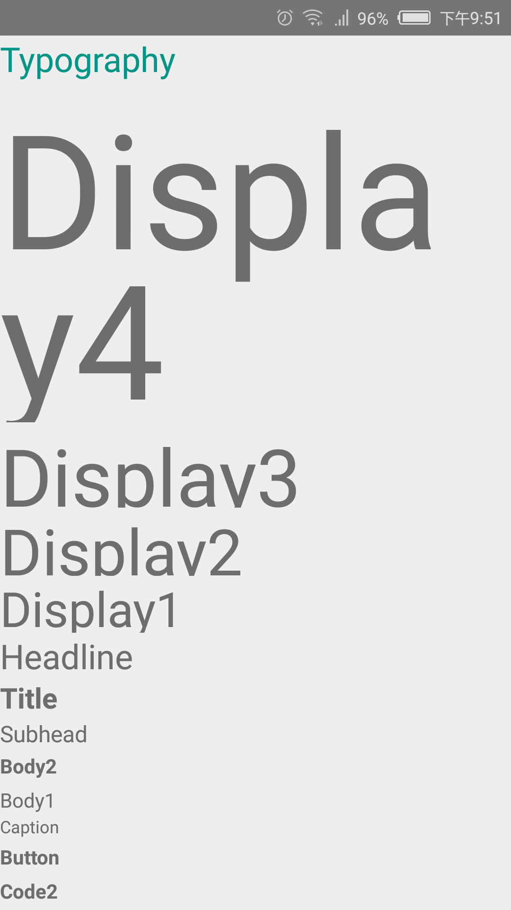
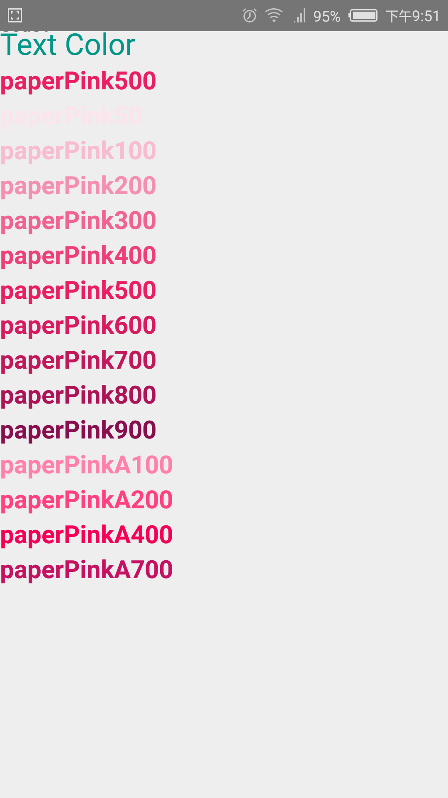
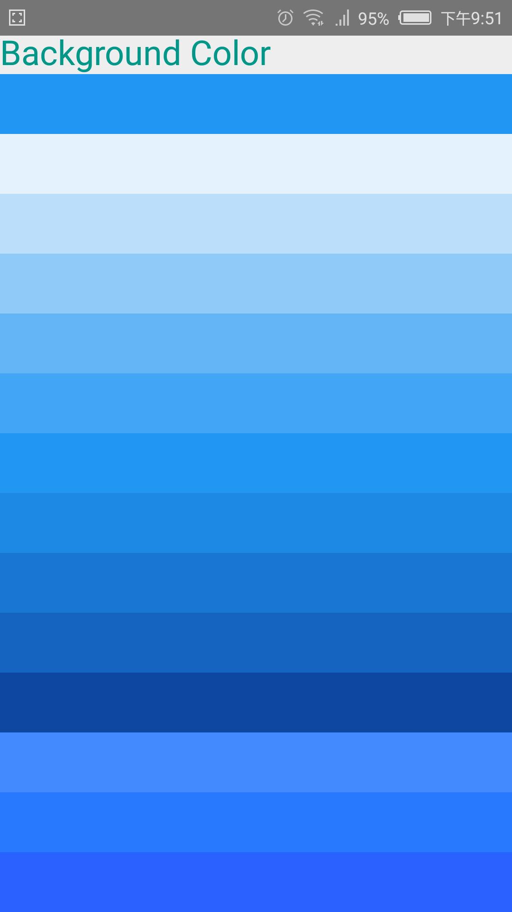
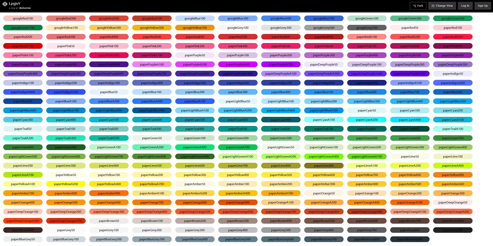

# [React Native Material Design Styles](http://github.com/binggg/react-native-material-design-styles)

React Native Material Design Styles is based on [paper-style](https://github.com/PolymerElements/paper-styles) which provides simple ways to use Material Design CSS styles in your application.　The difference is that this project is available in the form of React Native.

**Recommend**

[](http://mrn.js.org)

## A Material Design style React Native component library.

## Table of contents

* [Quick start](#quick-start)
* [Documentation](#documentation)

## Quick start

Install with [npm](https://www.npmjs.com): `npm install react-native-material-design-styles --save`.

## Documentation

### Typography

```javascript
import { StyleSheet } from 'react-native';
import { typography } from 'react-native-material-design-styles';
const typographyStyle = StyleSheet.create(typography);
```
Now we can use Material Design typography in our JSX code.
```javascript
<Text style={[typographyStyle.paperFontHeadline, colorStyle.paperTeal500]}>Typography</Text>
<Text style={[typographyStyle.paperFontDisplay4]}>Display4</Text>
<Text style={typographyStyle.paperFontDisplay3}>Display3</Text>
<Text style={typographyStyle.paperFontDisplay2}>Display2</Text>
<Text style={typographyStyle.paperFontDisplay1}>Display1</Text>
<Text style={typographyStyle.paperFontHeadline}>Headline</Text>
<Text style={typographyStyle.paperFontTitle}>Title</Text>
<Text style={typographyStyle.paperFontSubhead}>Subhead</Text>
<Text style={typographyStyle.paperFontBody2}>Body2</Text>
<Text style={typographyStyle.paperFontBody1}>Body1</Text>
<Text style={typographyStyle.paperFontCaption}>Caption</Text>
<Text style={typographyStyle.paperFontButton}>Button</Text>
<Text style={typographyStyle.paperFontCode2}>Code2</Text>
<Text style={typographyStyle.paperFontCode1}>Code1</Text>
```
Here is what it look:



### Color

```javascript
import { StyleSheet } from 'react-native';
import { color } from 'react-native-material-design-styles';
const typographyStyle = StyleSheet.create(typography);
```


#### Using for Text
```javascript
<Text style={[typographyStyle.paperFontHeadline, colorStyle.paperTeal500]}>Text Color</Text>
<Text style={[typographyStyle.paperFontTitle, colorStyle.paperPink500]}>paperPink500</Text>
<Text style={[typographyStyle.paperFontTitle, colorStyle.paperPink50]}>paperPink50</Text>
<Text style={[typographyStyle.paperFontTitle, colorStyle.paperPink100]}>paperPink100</Text>
<Text style={[typographyStyle.paperFontTitle, colorStyle.paperPink200]}>paperPink200</Text>
<Text style={[typographyStyle.paperFontTitle, colorStyle.paperPink300]}>paperPink300</Text>
<Text style={[typographyStyle.paperFontTitle, colorStyle.paperPink400]}>paperPink400</Text>
<Text style={[typographyStyle.paperFontTitle, colorStyle.paperPink500]}>paperPink500</Text>
<Text style={[typographyStyle.paperFontTitle, colorStyle.paperPink600]}>paperPink600</Text>
<Text style={[typographyStyle.paperFontTitle, colorStyle.paperPink700]}>paperPink700</Text>
<Text style={[typographyStyle.paperFontTitle, colorStyle.paperPink800]}>paperPink800</Text>
<Text style={[typographyStyle.paperFontTitle, colorStyle.paperPink900]}>paperPink900</Text>
<Text style={[typographyStyle.paperFontTitle, colorStyle.paperPinkA100]}>paperPinkA100</Text>
<Text style={[typographyStyle.paperFontTitle, colorStyle.paperPinkA200]}>paperPinkA200</Text>
<Text style={[typographyStyle.paperFontTitle, colorStyle.paperPinkA400]}>paperPinkA400</Text>
<Text style={[typographyStyle.paperFontTitle, colorStyle.paperPinkA700]}>paperPinkA700</Text>
```



#### Using for background or other ways

```javascript
<View style={[styles.colorItem,{backgroundColor: color.paperBlue500.color}]}></View>
<View style={[styles.colorItem,{backgroundColor: color.paperBlue50.color}]}></View>
<View style={[styles.colorItem,{backgroundColor: color.paperBlue100.color}]}></View>
<View style={[styles.colorItem,{backgroundColor: color.paperBlue200.color}]}></View>
<View style={[styles.colorItem,{backgroundColor: color.paperBlue300.color}]}></View>
<View style={[styles.colorItem,{backgroundColor: color.paperBlue400.color}]}></View>
<View style={[styles.colorItem,{backgroundColor: color.paperBlue500.color}]}></View>
<View style={[styles.colorItem,{backgroundColor: color.paperBlue600.color}]}></View>
<View style={[styles.colorItem,{backgroundColor: color.paperBlue700.color}]}></View>
<View style={[styles.colorItem,{backgroundColor: color.paperBlue800.color}]}></View>
<View style={[styles.colorItem,{backgroundColor: color.paperBlue900.color}]}></View>
<View style={[styles.colorItem,{backgroundColor: color.paperBlueA200.color}]}></View>
<View style={[styles.colorItem,{backgroundColor: color.paperBlueA400.color}]}></View>
<View style={[styles.colorItem,{backgroundColor: color.paperBlueA700.color}]}></View>
```



#### All colors

All color is show below, you can also [Watch in fullScreen](http://codepen.io/binggg/full/LpgJvY/) and you can copy color name.


